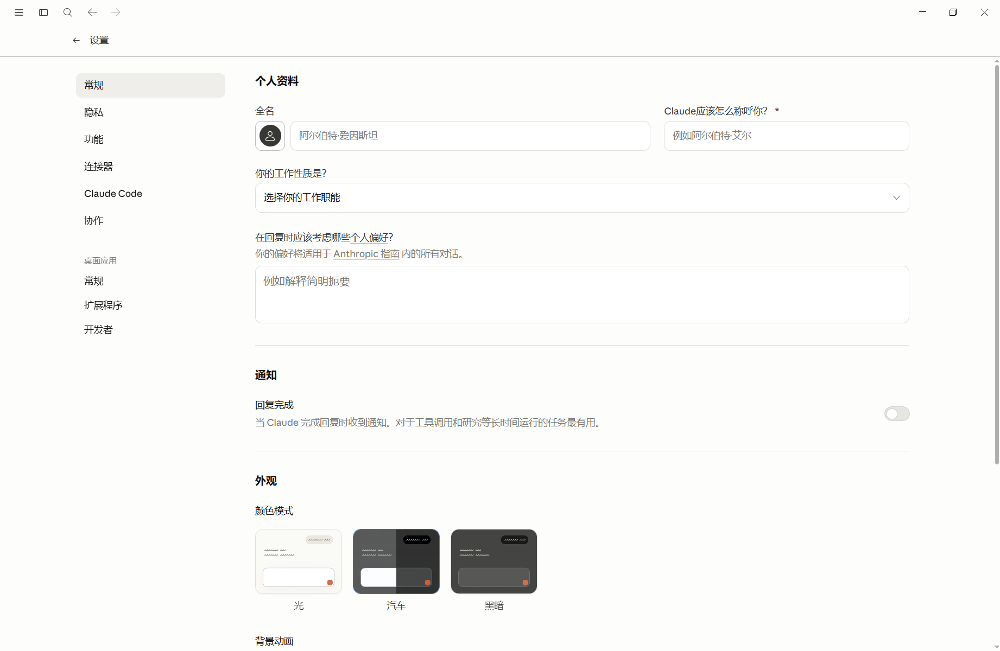
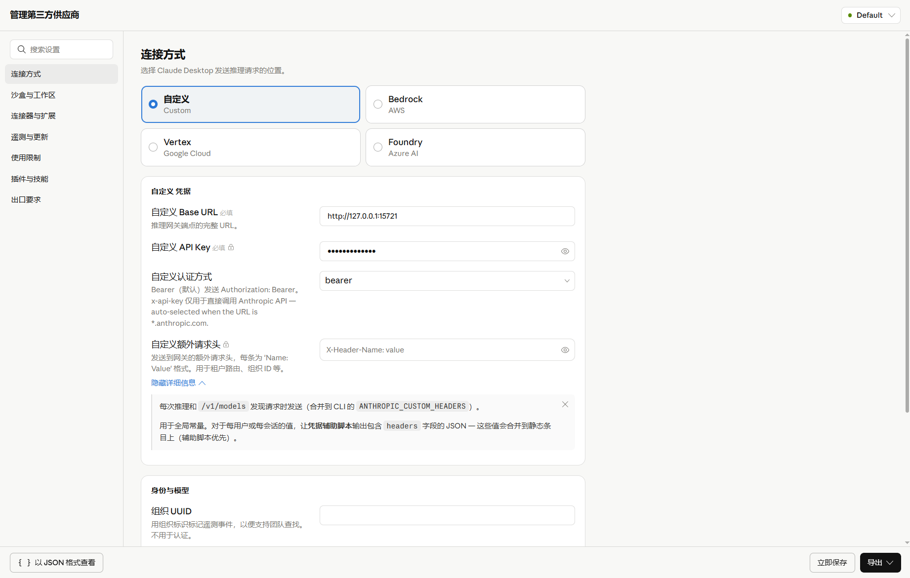
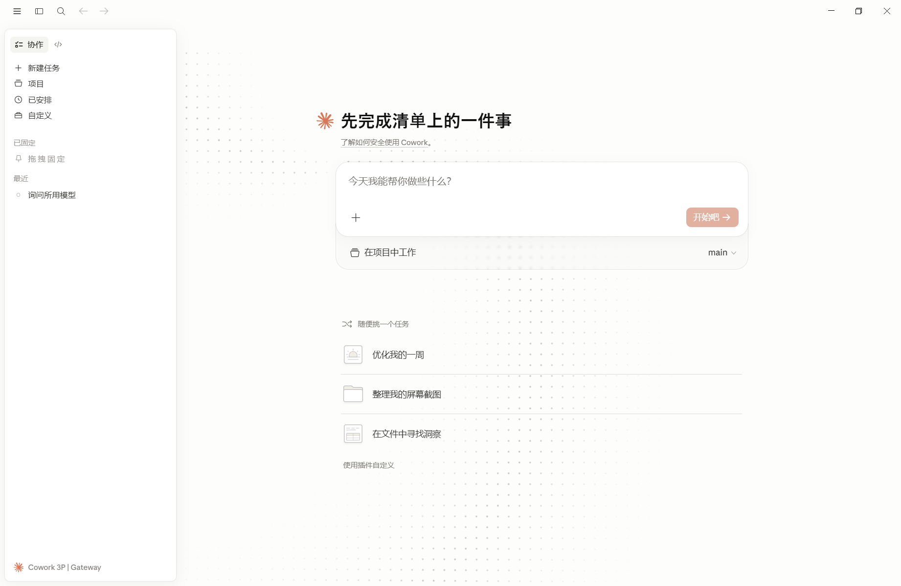
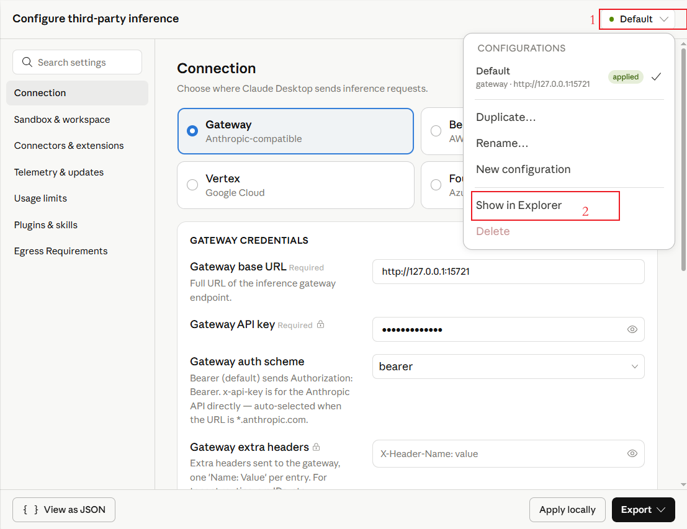
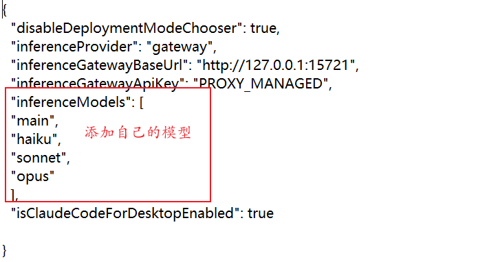

# Claude Desktop 中文资源与 Windows 补丁（zh-CN）

一个面向 Windows 版 Claude Desktop 的中文资源维护项目。

当前主线目标是：

- 维护 `resources/` 下的中文翻译资源
- 提供只面向普通界面的 Windows 补丁路径
- 不再把 `Configure Third-Party Inference` 纳入兼容或汉化目标

当前推荐的系统级方案是：

- 只 patch 官方包中的 JSON 语言资源
- 不再 patch 3P chunk
- 不再 patch 导航/运行时 chunk
- 不再为了汉化去改 `Configure Third-Party Inference`

历史上做过“导出副本补丁”和“bundle/chunk patch”实验，但这些方案已经降级为实验记录，不再作为主线推荐。

## 效果展示

<table>
<tr>
<td align="center"><b>主界面</b></td>
<td align="center"><b>设置页面</b></td>
</tr>
<tr>
<td></td>
<td></td>
</tr>
<tr>
<td align="center"><b>第三方推理配置</b></td>
<td align="center"><b>Cowork 面板</b></td>
</tr>
<tr>
<td></td>
<td></td>
</tr>
</table>

> 截图对应 Claude Desktop v1.3883.0.0 + 本项目补丁。实际界面可能因版本更新略有差异。

## 快速开始

以管理员身份运行 PowerShell，进入项目目录后执行：

```powershell
powershell -NoProfile -ExecutionPolicy Bypass -File .\claude-zh-cn.ps1
```

会出现交互式菜单，包含：安装、卸载、状态检查。按提示选择即可。

脚本会自动检测 Claude 安装路径，不需要手动填版本号。

如果你更喜欢直接运行单独的脚本：

```powershell
# 安装
powershell -NoProfile -ExecutionPolicy Bypass -File .\install-windowsapps-json-only.ps1

# 卸载 / 恢复英文
powershell -NoProfile -ExecutionPolicy Bypass -File .\restore-windowsapps-zh-cn.ps1
```

## 仓库结构

```
.
├── claude-zh-cn.ps1                   # 交互式安装/卸载菜单（推荐入口）
├── resources/
│   ├── desktop-zh-CN.json             # 桌面壳层翻译 355 keys
│   ├── frontend-zh-CN.json            # 前端界面翻译 12326 keys
│   └── statsig-zh-CN.json             # Statsig 功能描述翻译 46 keys
├── tools/
│   ├── validate_resources.py          # 资源 JSON 合法性校验
│   └── check_i18n_coverage.py         # 疑似未翻译条目检测
├── patch_windowsapps_json_only.py     # patch 脚本
├── install-windowsapps-json-only.ps1  # 安装入口（单独使用）
├── restore_claude_zh_cn_windowsapps.py # 恢复脚本
├── restore-windowsapps-zh-cn.ps1      # 恢复入口（单独使用）
├── README.md
├── CHANGELOG.md
└── LICENSE.md
```

## 翻译覆盖率

| 资源文件 | 英文 keys | 中文 keys | 覆盖率 |
|----------|-----------|-----------|--------|
| desktop-zh-CN.json | 355 | 355 | 100% |
| frontend-zh-CN.json | 12325 | 12326 | 100% |
| statsig-zh-CN.json | 46 | 46 | 100% |

所有可翻译条目均已汉化。品牌名（Claude、Anthropic、Google 等）和格式占位符按惯例保留英文。

## 当前主线

推荐优先使用这两部分内容：

- `resources/desktop-zh-CN.json`
- `resources/frontend-zh-CN.json`
- `resources/statsig-zh-CN.json`
- `tools/validate_resources.py`
- `tools/check_i18n_coverage.py`
- `patch_windowsapps_json_only.py`
- `install-windowsapps-json-only.ps1`

不再推荐作为主线使用的内容：

- 导出副本补丁脚本
- `patch_claude_zh_cn_windowsapps.py`
- `install-windowsapps-zh-cn.ps1`
- `patch_nav_chunk_labels.py`
- `patch_nav_all_chunks.py`
- `patch_3p_chunk_labels.py`

这些内容会继续保留在仓库中，作为历史实验和排查记录。

## 项目目标

- 为 Windows 版 Claude Desktop 提供可用的 `zh-CN` 中文界面。
- 尽量复用现有中文翻译资源，并随上游英文资源变化进行兼容合并。
- 把主线影响范围限制在语言资源层。
- 不再以 `Configure Third-Party Inference` 的可用性/汉化为目标。

## 当前建议使用方式

如果你只是要维护翻译资源或给普通界面打补丁，优先走下面这条：

1. 修改 `resources/` 下的翻译文件
2. 运行资源校验脚本
3. 使用 `install-windowsapps-json-only.ps1`
4. 只验证普通界面、设置页和常规文案

不要把下面这些页面当作当前主线验证目标：

- `Configure Third-Party Inference`
- 其它 3P 专属页面
- 依赖运行时 chunk 的实验性菜单项

## JSON-only 官方包补丁

当前仓库中，面向官方包的主线脚本是：

```text
patch_windowsapps_json_only.py
install-windowsapps-json-only.ps1
restore-windowsapps-zh-cn.ps1
```

这条路径只会写入：

- `resources\zh-CN.json`
- `resources\ion-dist\i18n\zh-CN.json`
- `resources\ion-dist\i18n\statsig\zh-CN.json`

它不会再主动做这些事：

- patch 3P chunk
- patch 导航 chunk
- 修改运行时 bundle 结构
- 把 `Configure Third-Party Inference` 作为兼容目标

## 说明

下面这部分内容对应的是早期的“导出副本补丁”路线。

它现在只作为历史记录保留：

- 不再是仓库主线
- 不建议新使用者优先采用
- 主要用于回看之前的实现方式和兼容性排查

## 功能特点

- 一键导出 Windows 版 Claude Desktop 的中文补丁副本。
- 自动给前端语言白名单加入 `zh-CN`。
- 自动合并当前 Claude 版本的英文前端语言文件与随包中文翻译。
- 新版本新增但暂未翻译的字段会保留英文，避免界面缺失文本。
- 不直接修改官方 `WindowsApps` 安装目录。
- 支持两种运行模式：
  - 保留 `locale`
  - 不保留 `locale`
- 两种运行模式都会继续使用原版 Claude 的用户数据目录，避免切换到一套新的空配置。

## 适用环境

- Windows
- 已安装 Microsoft Store / Appx 版 Claude Desktop
- 已安装 Python 3

## 设计原则

- 不直接替换官方安装包。
- 不依赖修改 `WindowsApps` 目录权限。
- 安装结果固定输出到用户本地目录，便于更新和删除。
- 启动时继续使用原版 Claude 的用户数据目录，减少对其它配置的扰动。

## 安装结果

安装完成后，补丁副本会生成到：

```text
C:\Users\<your-user>\AppData\Local\Claude-zh-CN
```

其中包含：

- `app\`：补丁后的可运行副本
- `run-windows-zh-cn-keep-locale.ps1/.bat`
- `run-windows-zh-cn-no-locale.ps1/.bat`
- `uninstall-windows-zh-cn.ps1/.bat`
- `README.md`

安装脚本执行完成后，固定安装目录中会自动生成对应的卸载器，无需手动复制。

## 目录结构

仓库目录：

```text
.
├─ install-windows-zh-cn.ps1
├─ patch_claude_zh_cn_windows.py
├─ resources/
│  ├─ desktop-zh-CN.json
│  ├─ frontend-zh-CN.json
│  ├─ statsig-zh-CN.json
│  └─ Localizable.strings
└─ README.md
```

安装后目录：

```text
C:\Users\<your-user>\AppData\Local\Claude-zh-CN
├─ app/
├─ run-windows-zh-cn-keep-locale.bat
├─ run-windows-zh-cn-keep-locale.ps1
├─ run-windows-zh-cn-no-locale.bat
├─ run-windows-zh-cn-no-locale.ps1
└─ README.md
```

## 使用方式

在当前目录运行：

```powershell
powershell -NoProfile -ExecutionPolicy Bypass -File .\install-windows-zh-cn.ps1
```

安装完成后，到下面目录启动：

```text
C:\Users\<your-user>\AppData\Local\Claude-zh-CN
```

### 方式 1：保留 locale

```text
run-windows-zh-cn-keep-locale.bat
```

或

```text
run-windows-zh-cn-keep-locale.ps1
```

这个模式会在启动前把原配置里的 `locale` 设为 `zh-CN`。

### 方式 2：不保留 locale

```text
run-windows-zh-cn-no-locale.bat
```

或

```text
run-windows-zh-cn-no-locale.ps1
```

这个模式会在启动前从原配置里移除 `locale`。

## 两种模式的区别

### 保留 `locale`

- 启动前把原配置中的 `locale` 设为 `zh-CN`
- 更适合希望稳定使用中文界面的场景
- 属于语言相关配置，不会主动改动第三方推理等其它业务配置

### 不保留 `locale`

- 启动前从原配置中移除 `locale`
- 更适合测试“只注入语言资源，不显式指定语言”时的行为
- 如果上游程序未自动切换到 `zh-CN`，则可能回退到英文

## 脚本会做什么

安装脚本会：

1. 识别本机已安装的 Claude 包。
2. 把官方包中的 `app` 目录复制到固定安装目录。
3. 写入中文桌面层资源 `resources\zh-CN.json`。
4. 合并前端 `ion-dist\i18n\zh-CN.json`。
5. 写入 `statsig\zh-CN.json`。
6. 修补前端语言白名单，加入 `zh-CN`。
7. 生成两套启动器到固定安装目录。

## 不会做什么

- 不会直接修改 `C:\Program Files\WindowsApps` 中的官方安装目录。
- 不会替换你原版 Claude 的可执行文件。
- 安装脚本默认不会强制写入 `locale`。
- 不会自动迁移一整套新的用户数据目录。

## 关于配置目录

补丁副本运行时不会使用一套新的空配置，而是继续使用原版 Claude 的用户数据目录：

```text
C:\Users\<your-user>\AppData\Local\Packages\Claude_pzs8sxrjxfjjc\LocalCache\Roaming
```

这样可以尽量减少对其它本地配置的影响，比如：

- 第三方推理配置
- 本地偏好设置
- 其它桌面配置

## 里的第三方推理说明

这部分是旧方案遗留说明，仅供参考。

当前仓库主线已经明确：

- 不再把 `Configure Third-Party Inference` 纳入补丁目标
- 不再围绕 3P 页面做兼容承诺
- 不再建议为了 3P 去修改运行时 bundle

以下内容保留为历史资料。

如果你要把 Desktop 接到本地代理，例如 `cc-switch`，推荐走官方的第三方推理入口，而不是直接改内部配置文件。

### 前置条件

在使用补丁版之前，建议确认以下条件：

- 已安装最新版 Claude Desktop。
- Windows 已启用 `VirtualMachinePlatform`。
- 如果你要使用 Cowork / VM 相关能力，请确认你的宿主机和虚拟化环境本身支持对应特性。
- 如果你使用 `cc-switch` 作为本地代理：
  - `cc-switch` 正在运行。
  - 你已经在 `cc-switch` 中导入了可用的 Claude provider。
  - `cc-switch` 已开启本地代理，常见地址为：`http://127.0.0.1:15721`
  - 如果你也在使用 CLI，建议保留 `C:\Users\<用户名>\.claude\settings.json` 里的代理配置。

这里有一个关键点：

**如果你要通过 Desktop 使用第三方推理或本地代理，`cc-switch` 一定要开启本地代理。**

如果你直接把 Desktop 的 Gateway base URL 填成某个固定 provider，比如：

```text
http://127.0.0.1:8317/v1
```

那么 Desktop 只会连这个固定后端。之后你在 `cc-switch` 里切换 provider，Desktop 不会跟着切换，你就需要重复手动改配置。

而 `cc-switch` 本地代理的意义是：

- Desktop 固定连本地入口
- `cc-switch` 负责把请求转发给当前选中的 provider
- 这样你切换 provider 时，Desktop 无需重复配置

补充说明：

- `newapi` 理论上也可以作为中转层
- 但在个人场景下，模型映射和配置通常更繁琐
- 如果你已经在使用 `cc-switch`，一般没有必要再额外套一层 `newapi`

### 打开 3P 设置界面

按官方桌面版菜单路径：

```text
Help -> Troubleshooting -> Enable Developer mode
Developer -> Configure third-party inference
```

这会打开官方的 3P Setup UI。

### Connection 选择

在 Connection 页面中，选择：

```text
Gateway
```

不建议在这个场景里选择：

- Bedrock
- Vertex
- Foundry

因为我们这里的目标是通过本地 `cc-switch` 作为统一入口。

### 推荐填写方式

按下面的方式填写：

- Gateway base URL
  - 填：`http://127.0.0.1:15721`
  - 具体以你自己的本地代理地址为准
- Gateway API key
  - 填：`PROXY_MANAGED`
- Gateway auth scheme
  - 选：`bearer`
- Gateway extra headers
  - 留空
- Organization UUID
  - 留空
- Credential helper script
  - 留空
- Skip login-mode chooser
  - 建议打开
- Bootstrap config URL
  - 留空

### 建议在 Show as JSON 中检查

建议切到 `Show as JSON` 看一眼，确认至少存在这些键：

```json
{
  "inferenceProvider": "gateway",
  "inferenceGatewayBaseUrl": "http://127.0.0.1:15721",
  "inferenceGatewayApiKey": "PROXY_MANAGED",
  "inferenceGatewayAuthScheme": "bearer",
  "inferenceModels": ["sonnet", "haiku", "opus"],
  "isClaudeCodeForDesktopEnabled": true
}
```

其中最关键的是：

- `inferenceProvider`
- `inferenceGatewayBaseUrl`
- `inferenceGatewayApiKey`
- `inferenceModels`
- `isClaudeCodeForDesktopEnabled`

### 关于 inferenceModels

`inferenceModels` 本质上是模型下拉框的候选列表。

如果不设置这项，可能会出现：

- 模型无法在 UI 中正常选择
- `cc-switch` 中对应的几个模型别名拉不出来

通常可以先按这种 Anthropic 风格别名填写：

```json
["sonnet", "haiku", "opus"]
```

它们更像是 UI 侧的 alias，不代表上游一定是真正的 Claude 官方模型名。





### 关于 isClaudeCodeForDesktopEnabled

```json
"isClaudeCodeForDesktopEnabled": true
```

建议确认它为 `true`，以确保 Code 页可见。


## Windows 虚拟化与 VMware / Hyper-V 说明

如果你只关心界面汉化，这一节可以跳过。

如果你要使用 Cowork、VM 或其它依赖虚拟化的平台能力，这一节很重要。

### 1. 启用 Windows 功能

常见命令：

```powershell
dism /online /enable-feature /featurename:VirtualMachinePlatform /all /norestart
dism /online /enable-feature /featurename:HypervisorPlatform /all /norestart
dism /online /enable-feature /featurename:Microsoft-Hyper-V-All /all /norestart
Restart-Computer
```

### 2. 验证 Hypervisor 是否启动

```powershell
bcdedit /enum | findstr "hypervisorlaunchtype"
```

正常情况下应看到：

```text
hypervisorlaunchtype    Auto
```

### 3. 验证相关 Windows 功能是否启用

```powershell
Get-WindowsOptionalFeature -Online | Where-Object {
    $_.FeatureName -in @(
        "VirtualMachinePlatform",
        "HypervisorPlatform",
        "Microsoft-Hyper-V-All"
    )
} | Select-Object FeatureName, State
```

如果三项都启用了，通常会看到：

```text
HypervisorPlatform     Enabled
VirtualMachinePlatform Enabled
Microsoft-Hyper-V-All  Enabled
```

### 4. VMware 并存场景

如果你在 VMware Workstation 17 中看到类似错误：

```text
VMware Workstation 在此主机上不支持嵌套虚拟化。
模块“HV”启动失败。
未能启动虚拟机。
```

并且 `vmware.log` 中有类似内容：

```text
hypervisor.cpuid.v0 = "FALSE"
```

这通常说明：

- 你的 Windows 主机已经启用了 Hyper-V / Hypervisor
- 但 VMware 当前环境不支持你想要的嵌套虚拟化组合

### 5. 当你要给 VMware 让路时

如果你的目标是优先让 VMware 的嵌套虚拟化正常工作，而不是优先保留 Windows Hypervisor，可尝试：

```powershell
bcdedit /set hypervisorlaunchtype off
Restart-Computer
```

这会关闭 Hyper-V 的启动，但不会卸载对应 Windows 功能。

### 6. 关于 VirtualMachinePlatform / Hyper-V / VMware 的关系

常见几种情况：

#### 情况 A：只开 `VirtualMachinePlatform`

- 适合只满足某些基础平台要求
- 对 VMware 干扰通常相对更小
- 但不保证满足所有 Cowork / VM 场景

#### 情况 B：开 `VirtualMachinePlatform` + `HypervisorPlatform`

- 常见于需要 Windows Hypervisor 能力但不一定启用完整 Hyper-V 的场景
- 可能仍会影响 VMware 的某些虚拟化能力

#### 情况 C：开 `VirtualMachinePlatform` + `Microsoft-Hyper-V-All`

- Windows 虚拟化能力最完整
- 与 VMware 并存时最容易遇到嵌套虚拟化问题

#### 情况 D：三个都开

- 对 Windows 原生虚拟化支持最全
- 但如果你还依赖 VMware 做嵌套虚拟化，这通常也是最容易冲突的一种组合

### 7. 实际建议

- 如果你的目标是使用 Claude Desktop 的相关平台能力，优先确认 `VirtualMachinePlatform` 已启用。
- 如果你的目标是同时兼顾 VMware 嵌套虚拟化，需要根据自己的虚拟机方案取舍是否关闭 `hypervisorlaunchtype`。
- 如果看到“此平台不支持虚拟化的 Intel VT-x/EPT”，不要只看 Windows 功能是否已启用，还要检查宿主机 BIOS / UEFI、虚拟机平台类型以及是否处于嵌套虚拟化场景中。

## 更新方式

如果 Claude Desktop 更新后界面资源结构发生变化：

1. 更新本仓库中的中文资源文件。
2. 重新运行：

```powershell
powershell -NoProfile -ExecutionPolicy Bypass -File .\install-windows-zh-cn.ps1
```

3. 重新从 `C:\Users\<your-user>\AppData\Local\Claude-zh-CN` 启动补丁版。

## 注意

- 官方 Claude 更新后，可能需要重新运行安装脚本。
- 这个方案是“导出副本补丁”，不是“原地替换官方安装包”。
- 不建议直接修改 `C:\Program Files\WindowsApps` 下的官方安装目录。
- Claude Desktop 更新后，导出的补丁副本不会自动跟随更新。官方版本更新后，通常需要重新运行 `install-windows-zh-cn.ps1`。
- 这个项目不会重新签名或替换官方 Appx / MSIX 包；请不要尝试手动修改 `WindowsApps` 下的官方文件来“覆盖安装”，否则可能触发系统权限、签名或包校验问题。

## 卸载 / 恢复

本项目不会直接改动官方安装目录，卸载方式也比较简单。

### 使用卸载脚本

可以直接运行：

```text
uninstall-windows-zh-cn.bat
```

或：

```powershell
powershell -NoProfile -ExecutionPolicy Bypass -File .\uninstall-windows-zh-cn.ps1
```

如果你还想在卸载时一并从原配置里移除 `locale`，可以运行：

```powershell
powershell -NoProfile -ExecutionPolicy Bypass -File .\uninstall-windows-zh-cn.ps1 -RemoveLocale
```

如果你要恢复到只使用官方 Claude Desktop：

1. 关闭补丁版 Claude。
2. 删除导出的补丁副本目录：

```text
C:\Users\<your-user>\AppData\Local\Claude-zh-CN
```

3. 如有需要，改回你自己的启动方式，不再使用补丁版启动器。

如果你使用的是“保留 locale”模式，并且希望把语言选择恢复为不显式指定 `zh-CN`，可以运行：

```text
run-windows-zh-cn-no-locale.bat
```

它会在启动前从原配置中移除 `locale`。

## 免责声明

本项目为非官方中文补丁，仅修改本机 Claude Desktop 的导出副本和本地资源文件。

Claude Desktop 更新后资源结构可能变化，若补丁失败，请先更新本项目中的脚本或资源，再重新运行安装脚本。

使用前请自行评估与本地环境、系统策略、公司合规要求以及软件更新机制的兼容性。

## 已知限制

- 该项目面向 Windows 商店 / Appx 版 Claude Desktop。
- 由于 Windows 安装包目录受保护，无法像 macOS `.app` 那样原地替换资源。
- 控制台在某些 Windows 编码环境下可能会把中文输出显示为乱码，但这不一定表示文件内容损坏。
- 如果上游资源命名或白名单写法发生变化，语言白名单补丁逻辑可能需要调整。

## 文件说明

- `install-windows-zh-cn.ps1`：Windows 安装入口。
- `patch_claude_zh_cn_windows.py`：真正执行补丁的 Python 脚本。
- `resources\frontend-zh-CN.json`：Claude 前端界面中文翻译。
- `resources\desktop-zh-CN.json`：Claude 桌面壳层中文翻译。
- `resources\statsig-zh-CN.json`：statsig i18n 资源。
- `resources\Localizable.strings`：来自参考仓库的原生字符串资源。

### 当前仓库实际文件清单

| 文件 | 用途 |
|------|------|
| `resources/desktop-zh-CN.json` | 桌面壳层翻译（菜单、对话框、系统托盘、Cowork 等） |
| `resources/frontend-zh-CN.json` | 前端界面翻译（聊天、设置、计费、项目、Artifacts 等） |
| `resources/statsig-zh-CN.json` | Statsig 功能描述翻译 |
| `patch_windowsapps_json_only.py` | 主线 patch 脚本：备份 → 写入 JSON → patch 白名单 → 设置 locale |
| `install-windowsapps-json-only.ps1` | 安装入口：关闭 Claude 进程后调用 patch 脚本 |
| `restore_claude_zh_cn_windowsapps.py` | 恢复脚本：从备份还原官方包资源 |
| `restore-windowsapps-zh-cn.ps1` | 恢复入口 |
| `tools/validate_resources.py` | 校验 JSON 资源文件合法性和 key 计数 |
| `tools/check_i18n_coverage.py` | 检测疑似未翻译条目，输出覆盖率报告 |
| `CHANGELOG.md` | 变更日志 |
| `LICENSE.md` | 许可声明 |

## 开发与维护

如果你要继续维护这个项目，建议关注：

- 官方 Windows 包版本号变化
- `resources\ion-dist\assets\v1\index-*.js` 中语言白名单写法是否变化
- `resources\ion-dist\i18n\en-US.json` 的 key 增减
- 桌面层 `resources\en-US.json` 的 key 增减

推荐维护流程：

1. 从已安装的官方包中导出新的英文资源。
2. 与现有中文资源按 key 合并。
3. 保留未知新 key 的英文回退。
4. 重新运行安装脚本验证补丁副本是否可启动。

## 参考来源

本项目的中文资源与思路参考自：

- `https://github.com/javaht/claude-desktop-zh-cn`

但本仓库实现的是适配 Windows 的版本，不是对原仓库的原样搬运。

## 许可与风险提示

- 本项目不是 Anthropic 官方发布内容。
- 请仅在你自己的设备和你能接受的风险范围内使用。
- 使用前请自行评估与本地环境、公司策略和软件更新机制的兼容性。

## Chunk UI 标签补丁

除了 JSON 语言资源之外，本项目还会对 Claude Desktop 的 JS bundle 文件进行安全的字符串替换，汉化以下区域的硬编码英文 UI 标签：

- 侧边栏导航（聊天 / 协作 / 代码 / 项目 / 已安排 / 自定义 等）
- Cowork 面板（状态筛选 / 时间筛选 / 分组方式 / 环境 等）
- 第三方推理设置页（连接方式 / 供应商配置 / 遥测 / 更新 / 插件 等）
- 会话管理（新建任务 / 编辑会话 / 删除会话 等）
- Conway 操作菜单（搜索 / 刷新 / 发送消息 / 调试日志 等）
- 代理 / 连接器 / 插件配置表单
- PR 状态 / CI 状态标签
- 加载状态 / 错误消息 / 通用按钮

这些替换由 `patch_chunks_zh_cn.py` 执行，安装脚本会自动调用。原始文件在替换前会自动备份。

### 当前仓库实际文件清单

| 文件 | 用途 |
|------|------|
| `claude-zh-cn.ps1` | 交互式安装 / 卸载菜单（推荐入口） |
| `claude-zh-cn.bat` | BAT 入口（双击运行，自动请求管理员权限） |
| `patch_windowsapps_json_only.py` | Step 1：写入 JSON 资源 + patch 白名单 + 设置 locale |
| `patch_chunks_zh_cn.py` | Step 2：替换 JS chunk 中的硬编码英文 UI 标签 |
| `install-windowsapps-json-only.ps1` | 独立安装脚本（自动执行 Step 1 + Step 2） |
| `restore_claude_zh_cn_windowsapps.py` | 恢复脚本（从备份还原 JSON + chunk + locale） |
| `restore-windowsapps-zh-cn.ps1` | 独立恢复脚本 |
| `resources/desktop-zh-CN.json` | 桌面壳层翻译（355 keys） |
| `resources/frontend-zh-CN.json` | 前端界面翻译（12326 keys） |
| `resources/statsig-zh-CN.json` | Statsig 功能描述翻译（46 keys） |
| `tools/validate_resources.py` | 校验 JSON 资源文件合法性 |
| `tools/check_i18n_coverage.py` | 检测疑似未翻译条目 |

## 致谢

感谢 [LINUX DO](https://linux.do/) 社区的支持与分享。

本项目的诞生离不开 LINUX DO 社区成员们的讨论、反馈和技术交流。如果你也是 LINUX DO 的一员，欢迎在社区中交流使用体验和改进建议。

同时感谢以下项目提供的参考和灵感：

- [javaht/claude-desktop-zh-cn](https://github.com/javaht/claude-desktop-zh-cn) — 本项目的中文翻译资源最初参考自该仓库
